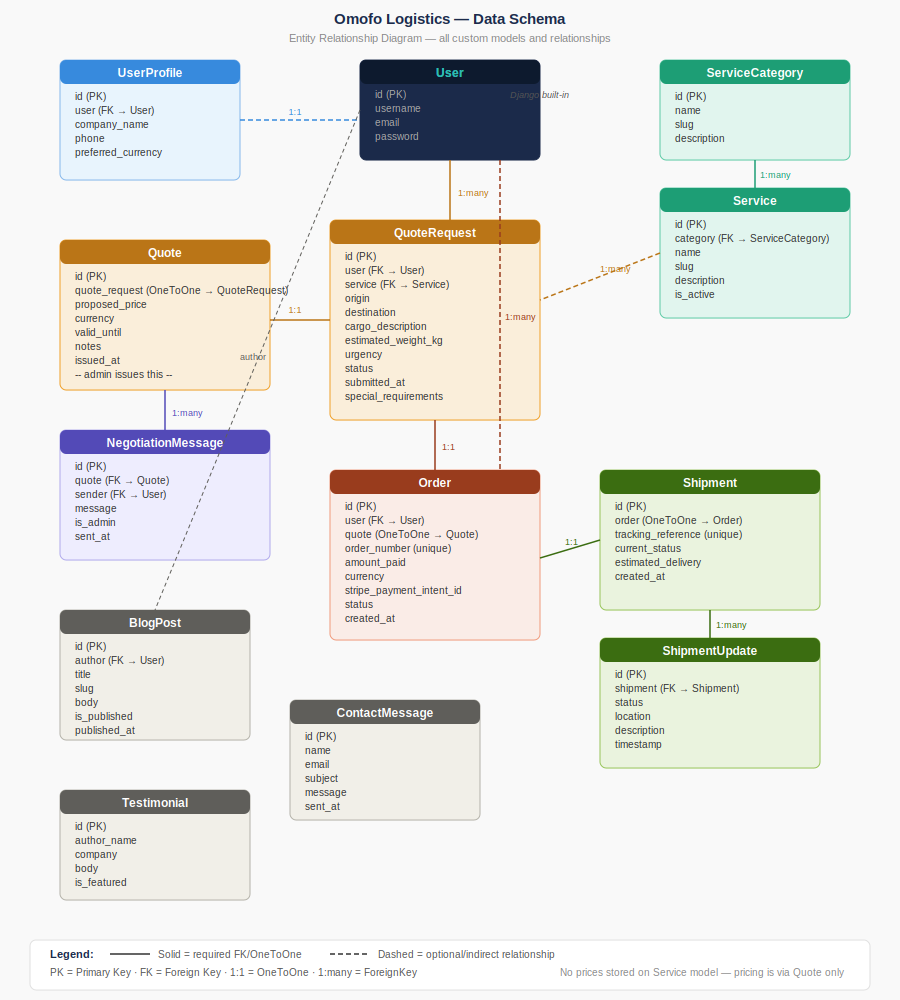

# Omofo Logistics — Full Stack Django Shipping Platform

A full-stack e-commerce web application built with Django for the Code Institute MS4 project. Omofo Logistics is a real logistics business platform where customers can request bespoke shipping quotes, negotiate pricing, pay securely via Stripe in multiple currencies, and track their shipments.

**Live site:** https://omof-logistics.onrender.com
**GitHub:** https://github.com/timothyosaigbovo/omof-logistics

---

## Table of Contents

- [Project Overview](#project-overview)
- [Business Strategy](#business-strategy)
- [UX Design](#ux-design)
- [User Stories](#user-stories)
- [Features](#features)
- [Data Models](#data-models)
- [Technologies Used](#technologies-used)
- [Testing](#testing)
- [Deployment](#deployment)
- [Credits](#credits)

---

## Project Overview

Omofo Logistics offers freight forwarding, customs clearance, ocean and air freight, and e-commerce logistics services across Africa and beyond. Unlike standard e-commerce sites, pricing is bespoke — every shipment is different. This platform reflects that reality through a quote-negotiation-then-pay flow.

---

## Business Strategy

No prices are displayed on the site. Every customer submits a Request for Quote (RFQ). The admin reviews and issues a custom quote. Client and admin negotiate via a message thread. Once agreed, the client pays via Stripe in their chosen currency. This mirrors how real logistics businesses operate.

---

## UX Design

### Wireframes

Wireframes were created for all key pages before development began.

| Page | Wireframe |
|------|-----------|
| Home page | [wireframe-home.svg](docs/wireframes/wireframe-home.svg) |
| Request for Quote form | [wireframe-rfq-form.svg](docs/wireframes/wireframe-rfq-form.svg) |
| Client dashboard | [wireframe-dashboard.svg](docs/wireframes/wireframe-dashboard.svg) |
| Booking summary + currency selector | [wireframe-booking-summary.svg](docs/wireframes/wireframe-booking-summary.svg) |
| Negotiation thread | [wireframe-negotiation.svg](docs/wireframes/wireframe-negotiation.svg) |

### Design decisions

- No prices shown anywhere on the site — all pricing is handled through the RFQ and negotiation flow
- Currency selector appears only at checkout, not site-wide, to avoid confusion before a quote is agreed
- Negotiation thread uses chat-bubble styling to clearly distinguish admin and client messages
- Shipment tracking uses an animated timeline to show progress at a glance

---

## User Stories

### Visitor
- Browse service descriptions without seeing prices
- Register for an account
- Read blog posts and testimonials
- Submit a contact form

### Authenticated Client
- Submit a Request for Quote with service, route, cargo, weight and urgency
- View all RFQs and their status on the dashboard
- Receive and view admin-issued quotes
- Negotiate price via a message thread
- Accept a quote and choose payment currency
- Pay securely via Stripe in GBP, USD, EUR, NGN, CAD or GHS
- Track shipment status via an animated timeline

### Admin
- View and manage all RFQs in Django admin
- Issue custom quotes with price, currency, validity and notes
- Reply to client negotiation messages
- Create shipments and add status updates

---

## Features

- **Quote request system** — clients submit detailed RFQs with service, route, cargo and urgency
- **Negotiation messaging** — threaded chat between client and admin with auto-refresh
- **Multi-currency checkout** — Stripe PaymentIntent in 6 currencies (GBP, USD, EUR, NGN, CAD, GHS)
- **Shipment tracking** — animated timeline with status updates added by admin
- **Client dashboard** — live RFQ list, order history and shipment tracking links
- **Blog** — published posts manageable via Django admin
- **Contact form** — saves messages to database, visible in admin
- **AWS S3** — media file storage in production via django-storages
- **Allauth** — full authentication with email/username login

---

## Data Models

### Schema diagram

### accounts
- **UserProfile** — extends Django User with company_name, phone, preferred_currency (OneToOne)

### services
- **ServiceCategory** — groups services by type (name, slug)
- **Service** — individual service with description and image. No price fields — pricing handled via Quote only

### quotes
- **QuoteRequest** — client RFQ with origin, destination, cargo, urgency and status (pending/quoted/negotiating/accepted/rejected)
- **Quote** — admin-issued quote with proposed_price, currency, valid_until and notes (OneToOne with QuoteRequest)

### negotiations
- **NegotiationMessage** — message in a thread linked to a Quote, with is_admin flag to distinguish sender

### checkout
- **Order** — confirmed payment record with auto-generated order_number, amount_paid, currency, Stripe payment intent ID and status

### tracking
- **Shipment** — linked OneToOne to Order with tracking_reference and current_status
- **ShipmentUpdate** — individual status update with location, description and timestamp

### blog
- **BlogPost** — published article with title, slug, author, body, image and is_published flag

### contact
- **ContactMessage** — contact form submission saved to database

### reviews
- **Testimonial** — featured testimonial with author_name, company, body and is_featured flag

---

## Technologies Used

- **Python 3.12** / **Django 4.x**
- **PostgreSQL** — production database via Render
- **Stripe** — payment processing with multi-currency support
- **AWS S3** — media file storage via django-storages and boto3
- **Bootstrap 5** — responsive frontend framework
- **WhiteNoise** — static file serving in production
- **Gunicorn** — production WSGI server
- **Render** — cloud deployment platform
- **GitHub** — version control with 122+ commits

---

## Testing

### Lighthouse scores

| Device | Performance | Accessibility | Best Practices | SEO |
|--------|-------------|---------------|----------------|-----|
| Mobile | 95 | 74 | 100 | 90 |
| Desktop | 100 | 83 | 100 | 90 |

Screenshots: [Mobile](docs/testing/lighthouse-mobile.png) · [Desktop](docs/testing/lighthouse-desktop.png)

### Validation results

| Test | Tool | Result |
|------|------|--------|
| HTML — Home | W3C Validator | [Pass](docs/testing/html-validation-home.png) |
| HTML — Services | W3C Validator | [Pass](docs/testing/html-validation-services.png) |
| HTML — Contact | W3C Validator | [Pass](docs/testing/html-validation-contact.png) |
| HTML — Blog | W3C Validator | [Pass](docs/testing/html-validation-blog.png) |
| CSS | W3C Jigsaw | [No errors](docs/testing/css-validation.png) |
| JavaScript — currency_selector | JSHint | [1 advisory warning](docs/testing/js-validation-currency.png) |
| JavaScript — negotiation_thread | JSHint | [No errors](docs/testing/js-validation-negotiation.png) |
| JavaScript — tracking_timeline | JSHint | [No errors](docs/testing/js-validation-tracking.png) |
| Python PEP8 | pycodestyle | [Pass](docs/testing/pep8-validation.png) |

### Automated tests

Run the full test suite:

\\\ash
python manage.py test
\\\

23 automated tests across 6 apps covering models and views — all passing.

### Manual testing — full user journey

#### Customer journey

| Step | Action | Expected | Result | Screenshot |
|------|--------|----------|--------|------------|
| 1 | Register new account | Redirect to home, logged in | Pass | [View](docs/testing/manual-01-register.png) |
| 2 | Submit RFQ (Air Freight, London to Lagos) | RFQ created with Pending status | Pass | [View](docs/testing/manual-02-rfq-submit.png) |
| 5 | View quote issued by admin | Quote shown with price GBP 1200 | Pass | [View](docs/testing/manual-05-customer-views-quote.png) |
| 6 | Send negotiation message | Message appears in thread | Pass | [View](docs/testing/manual-06-customer-negotiation.png) |
| 8 | Accept quote — select GBP currency | Booking summary with currency selector | Pass | [View](docs/testing/manual-08-accept-quote-currency.png) |
| 9 | Pay via Stripe test card 4242 4242 4242 4242 | Payment success page | Pass | [View](docs/testing/manual-10-payment-success.png) |
| 10 | View shipment tracking timeline | Booked status with location shown | Pass | [View](docs/testing/manual-13-shipment-tracking.png) |

#### Admin journey

| Step | Action | Expected | Result | Screenshot |
|------|--------|----------|--------|------------|
| 3 | View incoming RFQ in admin | RFQ visible with all details | Pass | [View](docs/testing/manual-03-admin-view-rfq.png) |
| 4 | Issue quote against RFQ | Quote saved, RFQ status changes to Quoted | Pass | [View](docs/testing/manual-04-admin-issue-quote.png) |
| 7 | Reply to negotiation thread | Message sent, visible to customer | Pass | [View](docs/testing/manual-07-admin-negotiation-reply.png) |
| 11 | Create shipment with tracking update | Shipment created, timeline visible to customer | Pass | [View](docs/testing/manual-11-admin-create-shipment.png) |

### Responsive testing

Tested on mobile (Galaxy Tab S4, 712px), tablet and desktop using Chrome DevTools device toolbar. Site is fully responsive using Bootstrap 5 grid.

---

## Deployment

### Local setup

\\\ash
git clone https://github.com/timothyosaigbovo/omof-logistics.git
cd omof-logistics
python -m venv venv
venv\Scripts\activate
pip install -r requirements.txt
\\\

Create a \.env\ file:

\\\
SECRET_KEY=your-secret-key
DEBUG=True
STRIPE_PUBLIC_KEY=pk_test_...
STRIPE_SECRET_KEY=sk_test_...
STRIPE_WH_SECRET=whsec_...
AWS_ACCESS_KEY_ID=...
AWS_SECRET_ACCESS_KEY=...
AWS_STORAGE_BUCKET_NAME=omof-logistics-media
AWS_S3_REGION_NAME=eu-west-2
\\\

\\\ash
python manage.py migrate
python manage.py createsuperuser
python manage.py setup_sample_data
python manage.py runserver
\\\

### Render deployment

1. Push code to GitHub
2. Connect repo to Render via Blueprint (render.yaml in root)
3. Add environment variables in Render dashboard
4. Deploy — migrations run automatically on build
5. Run \python manage.py setup_sample_data\ in Render Shell to populate data

Environment variables required: SECRET_KEY, DEBUG, DATABASE_URL, STRIPE_PUBLIC_KEY, STRIPE_SECRET_KEY, STRIPE_WH_SECRET, AWS_ACCESS_KEY_ID, AWS_SECRET_ACCESS_KEY, AWS_STORAGE_BUCKET_NAME, AWS_S3_REGION_NAME

### Security

- All secret keys stored in environment variables, never committed to repository
- DEBUG set to False in production
- HTTPS enforced via SECURE_SSL_REDIRECT
- SESSION_COOKIE_SECURE and CSRF_COOKIE_SECURE enabled
- HSTS configured for production

---

## Credits

- Code Institute — project framework and assessment criteria
- Stripe — payment processing documentation
- AWS — S3 storage documentation
- Bootstrap — frontend components
- Django documentation — models, views, authentication
- django-allauth — authentication library
- django-storages — AWS S3 integration
- django-countries — country field for UserProfile

---

## Acknowledgements

Special thanks to Code Institute for the project framework and to the open source community for the tools and libraries that made this project possible.

Project completed March 2026.
